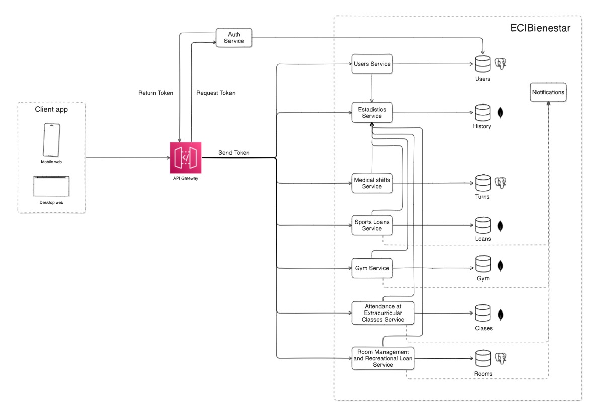
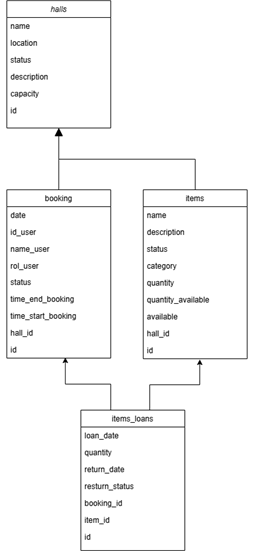
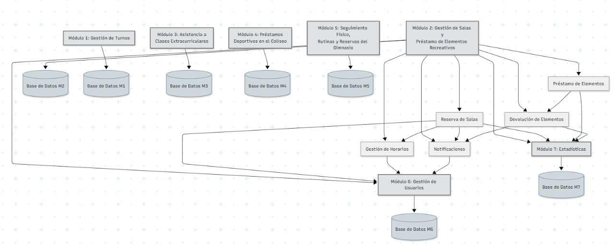
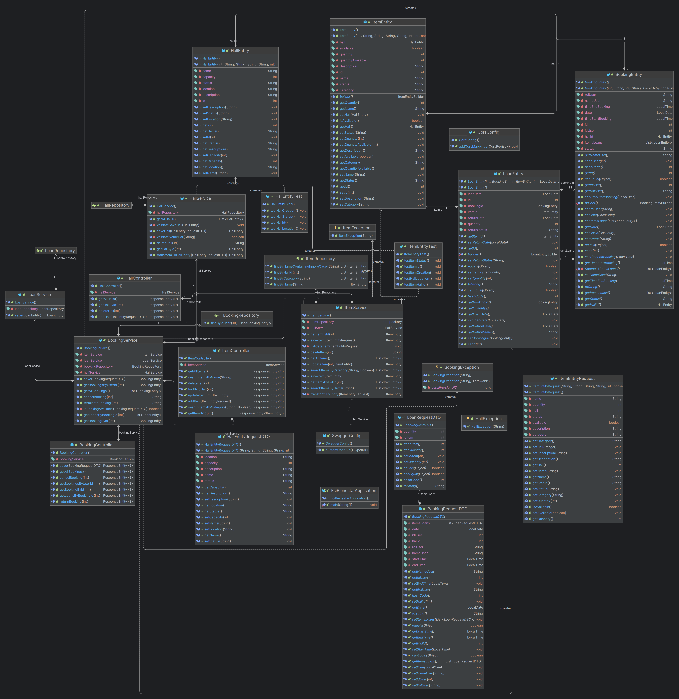
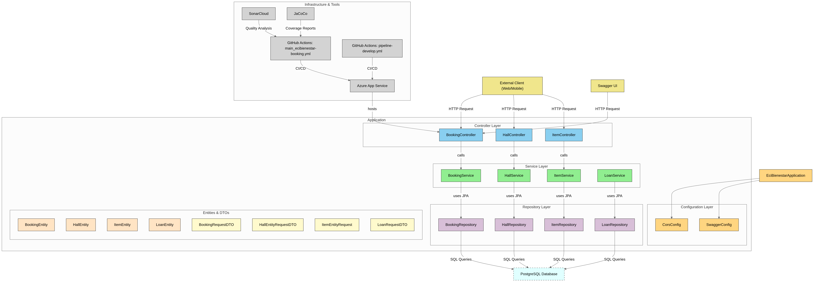

# ECI-Bienestar Module Booking Loan Services

[](https://github.com/ECIBienestar/circonio-booking-loans-services/actions)
[](LICENSE)
[](https://www.oracle.com/java/technologies/javase/jdk17-archive-downloads.html)
[](https://spring.io/projects/spring-boot)
[](https://maven.apache.org/)
[](https://junit.org/junit5/)
[](https://sonarcloud.io/)
[](https://azure.microsoft.com/)

## Introduction

The **ECI-Bienestar Booking Loan Services** is a Spring Boot application designed to streamline the reservation of recreational spaces and the loan/return of items (e.g., board games, equipment) for the academic community at Escuela Colombiana de Ingeniería. This service promotes university well-being by offering an organized, accessible platform for managing bookings and loans.

Key features:
- Reserve break and recreation rooms.
- Manage loans and returns of recreational items.
- RESTful API with Swagger documentation.
- CI/CD integration with Azure and GitHub Actions.

## Authors

- [Nicole Dayan Calderon Arevalo](https://github.com/nicolecalderon)
- [Alison Geraldine Valderrama Munar](https://github.com/alisongvalderrama)
- [Jeimy Alejandra Yaya Martinez](https://github.com/jeimyyaya)

## Technologies Used

| Technology      | Version       | Purpose                     |
|-----------------|---------------|-----------------------------|
| Java            | 17            | Backend development         |
| Spring Boot     | 3.x           | Application framework       |
| Maven           | Latest        | Build automation            |
| JUnit           | 5             | Unit testing                |
| JaCoCo          | Latest        | Code coverage               |
| SonarCloud      | -             | Code quality analysis       |
| Azure           | -             | Deployment and CI/CD        |
| PostgreSQL      | Latest        | Database (via Supabase)     |
| Swagger         | -             | API documentation           |

## Microservices Diagram



## Project Structure

```bash
ECI-Bienestar/
├── .github/workflows/          # GitHub Actions workflows
├── src/
│   ├── main/
│   │   ├── java/com/booking/   # Application source code
│   │   │   ├── config/         # Configuration classes
│   │   │   ├── controller/     # REST controllers
│   │   │   ├── entity/        # JPA entities and DTOs
│   │   │   ├── exception/     # Custom exceptions
│   │   │   ├── repository/    # JPA repositories
│   │   │   ├── service/       # Business logic
│   │   │   └── EciBienestarApplication.java
│   │   └── resources/         # Configuration files
│   └── test/                  # Unit and integration tests
├── image/                     # Diagrams and screenshots
├── .mvn/                      # Maven wrapper
├── pom.xml                    # Maven dependencies
└── README.md
```

## Diagrams

- **Data Model**: Represents the database schema for bookings, loans, and items.

  

  The diagram shows the following relationships between these tables:

  - Items_Loan connects to Items, linking which items are included in each loan.
  - Items_Loan connects to Booking, showing which bookings include which items.
  - Booking connects to Hall, indicating the hall being booked.

This database design follows a suitable structure for PostgreSQL:

  1. Separation of Responsibilities: Each table has a specific purpose, fulfilling its specific need, following good design principles.

  2. Relationship Management: The join table Items_Loan follows a many-to-many relationship pattern, allowing multiple items to be associated with multiple bookings.

  3. Data Integrity: Foreign key relationships ensure that data remains consistent across all tables.

- **Diagrama de modulos que se utilizan**:
   
  In this diagram, the Modules that use this microservice are:

  - Module 2 (Hall Management and Recreational Item Loans): Calls it directly for hall bookings.

  - Module 6 (User Management): Authenticates and validates users.

  - Module 7 (Statistics): Queries statistics on bookings and loaned items.

- **Class Diagram**: 
  

- **Component Diagram**:


  

## HAPPY PATH


## API Endpoints

### 1. Gestión de Salas (Hall Management)

| Method | Endpoint | Description | Parameters | Body | Responses |
|--------|----------|-------------|------------|------|-----------|
| POST | /api/halls | Register a new hall | - | HallEntity object | 201: Hall successfully created<br>400: Invalid data<br>500: Internal error |
| GET | /api/halls/{id} | Get hall by ID | id: Hall ID | - | 200: Hall details<br>404: Hall not found |
| DELETE | /api/halls/{id} | Delete hall by ID | id: Hall ID | - | 200: Hall deleted<br>404: Hall does not exist |
| GET | /api/halls/all | Get all halls | - | - | 200: List of halls<br>404: No halls found |


Full API documentation is available via [Swagger UI](https://ecibienestar-booking-hnbeerf3caafcacs.canadacentral-01.azurewebsites.net/swagger-ui/index.html).

## Setup and Running the Project

### Prerequisites
- **Java 17**: [Download](https://www.oracle.com/java/technologies/javase/jdk17-archive-downloads.html)
- **Maven**: [Download](https://maven.apache.org/download.cgi)
- **PostgreSQL**: Use [Supabase](https://supabase.com/) or a local PostgreSQL instance.
- **Git**: For cloning the repository.

### Steps to Run
1. **Clone the repository**:
   ```bash
   git clone https://github.com/ECIBienestar/circonio-booking-loans-services.git
   cd circonio-booking-loans-services
   ```

2. **Configure the database**:
   - Create a Supabase project and obtain the database URL.
   - Update `src/main/resources/application.properties`:
     ```properties
     spring.application.name=EciBienestar
     spring.datasource.username=postgres
     spring.datasource.password=your_supabase_password
     spring.datasource.url=jdbc:postgresql://db.tbdioafooovaedfssykt.supabase.co:5432/postgres
     spring.jpa.hibernate.ddl-auto=update
     ```

3. **Build and run the application**:
   ```bash
   mvn clean install
   mvn spring-boot:run
   ```

4. **Access the application**:
   - API: `http://localhost:8080`
   - Swagger UI: `http://localhost:8080/swagger-ui/index.html`
   [](https://ecibienestar-booking-hnbeerf3caafcacs.canadacentral-01.azurewebsites.net/swagger-ui/index.html)

### Troubleshooting
- **Database connection issues**: Verify Supabase credentials and network access.
- **Port conflicts**: Ensure port `8080` is free or update `server.port` in `application.properties`.

## CI/CD and Deployment

The project uses **Azure Pipelines** and **GitHub Actions** for continuous integration and deployment:
- **GitHub Actions**: Runs tests and code quality checks on pull requests (`pipeline-develop.yml`).
- **Azure Pipelines**: Deploys the application to Azure App Service (`main_ecibienestar-booking.yml`).

### Deployment Details
- Hosted on Azure App Service.
- Swagger UI: [Link](https://ecibienestar-booking-hnbeerf3caafcacs.canadacentral-01.azurewebsites.net/swagger-ui/index.html).


## Testing and Code Quality

- **Unit Tests**: Written with JUnit 5, covering entities, services, and controllers.
- **Code Coverage**: Measured with JaCoCo, targeting >80% coverage.
- **Static Analysis**: Integrated with SonarCloud for code quality and security checks.
- Run tests locally:
  ```bash
  mvn test
  ```
- View coverage report: `target/site/jacoco/index.html`.

[SonarCloud Dashboard](https://sonarcloud.io/dashboard?id=ECIBienestar_circonio-booking-loans-services)

## Contributing

We welcome contributions! To contribute:
1. Fork the repository.
2. Create a feature branch (`git checkout -b feature/my-feature`).
3. Commit your changes (`git commit -m "Add my feature"`).
4. Push to the branch (`git push origin feature/my-feature`).
5. Open a pull request.

Please follow our [Code of Conduct](CODE_OF_CONDUCT.md) and use the [issue templates](.github/ISSUE_TEMPLATE).

For questions, contact us via [GitHub Issues](https://github.com/ECIBienestar/circonio-booking-loans-services/issues).

## License

This project is licensed under the MIT License. See the [LICENSE](LICENSE) file for details.

## Acknowledgments

- [Spring Boot](https://spring.io/projects/spring-boot) for the robust framework.
- [Supabase](https://supabase.com/) for managed PostgreSQL hosting.
- [Swagger](https://swagger.io/) for API documentation.
- The Escuela Colombiana de Ingeniería community for inspiration.

---

<div align="center">
  <b>ECI-Bienestar Circonio Team</b><br>
  <i>Empowering well-being through technology</i>
</div>