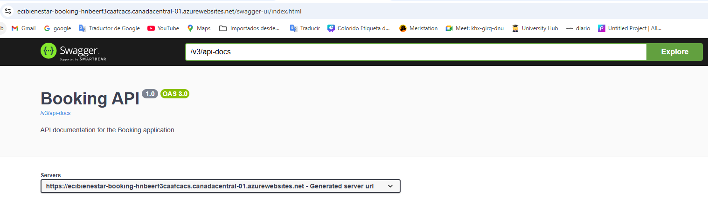

# ECI-Bienestar Booking Loan Services

This module allows for the efficient management of break and recreation room reservations, as well as the loan and return of recreational items such as board games and equipment available in these rooms. It is designed to be used by members of the School's academic community, allowing for an organized, accessible experience aligned with promoting university well-being.

## Authors

* Nicole Dayan Calderon Arevalo
* Alison Geraldine Valderrama Munar  
* Sebastián Julián Villarraga Guerrero
* Jeimy Alejandra Yaya Martinez


## Module Description

Manages the reservations of spaces and the loans of recreational objects. Administers availability, loans, returns, and cancellations using a modular RESTful approach.

## Technologies Used
- **Java 17**
- **Spring Boot 3.x** 
- **Maven**
- **JUnit 5** 
- **JaCoCo** 
- **SonarCloud** 
- **Azure**


## Project Structure
```
ECI-Bienestar/
│
├── .gitattributes
├── .gitignore
├── mvnw / mvnw.cmd
├── pom.xml
├── README.md
│
├── .mvn/
│   └── wrapper/
│       └── maven-wrapper.properties
│
├── src/
│   ├── main/
│   │   ├── java/
│   │   │   └── com/booking/
│   │   │       └── EciBienestarApplication.java
│   │   └── resources/
│   │       ├── application.properties
│   │       ├── static/
│   │       └── templates/
│   └── test/
│       └── java/com/booking/
│           └── EciBienestarApplicationTests.java
│
└── target/
    ├── classes/
    │   └── com/booking/
    │       └── EciBienestarApplication.class
    └── test-classes/
        └── com/booking/
            └── EciBienestarApplicationTests.class
```
## Diagramas
- **Diagramas de datos**: 
    

- **Diagramas de clases**: 
- **Diagramas de componentes**: 
- **Diagrama de Secuencia**: 


##  How to Run the Project

### Prerequisites
- Install **Java 17**
- Install **Maven**

### Steps to Run

1. Clone the repository:
   ```bash
   git clone https://github.com/ECIBienestar/circonio-booking-loans-services.git
   ```

2. Configure database connection in `application.properties`:
   ```properties
   spring.application.name=EciBienestar
   spring.datasource.username=postgres
   spring.datasource.url=jdbc:postgresql://db.tbdioafooovaedfssykt.supabase.co:5432/postgres?
   ```

3. Build and run the application:
   ```bash
   mvn clean install
   mvn spring-boot:run
   ```


## API Endpoints

## Despliegue CI/CD 

Azure Pipelines configured for automatic deployment.

GitHub Actions integrated.

Deployed on Azure App Service.


Documented with Swagger.



# Enlaces

🔗 Swagger UI: https://ecibienestar-booking-hnbeerf3caafcacs.canadacentral-01.azurewebsites.net/swagger-ui/index.html


